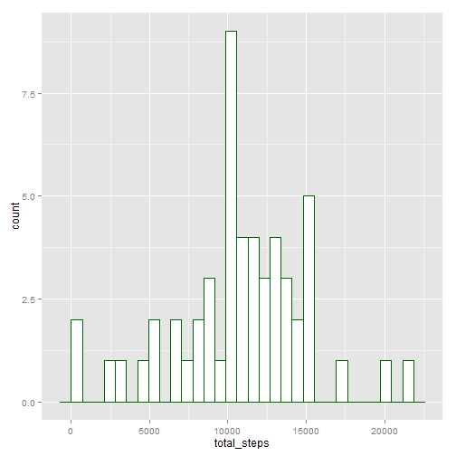
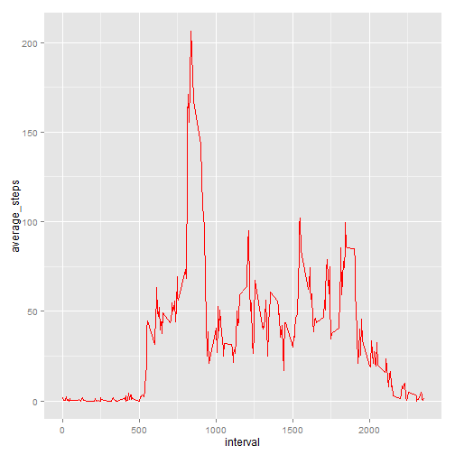
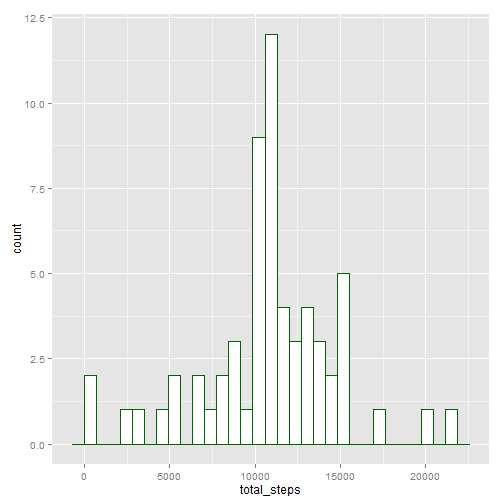
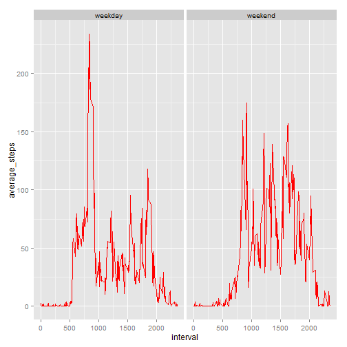

#Reproducible Research Course Assignment:
#Peer Assessment1

---
title: "PA1_template"
output: 
  html_document: 
    keep_md: true
---

##Loading and preprocessing the data

Download the data set from the web source and unzip it at the local "./data" directory

```r
if(!file.exists("./data")) {
    dir.create("./data")
}
  
fileUrl <- "https://d396qusza40orc.cloudfront.net/repdata%2Fdata%2Factivity.zip"

if(!file.exists("./data/activity")) {
    download.file(fileUrl, destfile="./data/activity.zip", method = "libcurl")
    unzip(zipfile="./data/activity.zip", exdir="./data")
}
```

Loading and preprocessing the data

Convert "Factor" variable to variables of class "Date" representing calendar dates

```r
move_data <- read.csv("./data/activity.csv")
str(move_data)
```

```
## 'data.frame':	17568 obs. of  3 variables:
##  $ steps   : int  NA NA NA NA NA NA NA NA NA NA ...
##  $ date    : Factor w/ 61 levels "2012-10-01","2012-10-02",..: 1 1 1 1 1 1 1 1 1 1 ...
##  $ interval: int  0 5 10 15 20 25 30 35 40 45 ...
```

```r
head(move_data)
```

```
##   steps       date interval
## 1    NA 2012-10-01        0
## 2    NA 2012-10-01        5
## 3    NA 2012-10-01       10
## 4    NA 2012-10-01       15
## 5    NA 2012-10-01       20
## 6    NA 2012-10-01       25
```

```r
tail(move_data)
```

```
##       steps       date interval
## 17563    NA 2012-11-30     2330
## 17564    NA 2012-11-30     2335
## 17565    NA 2012-11-30     2340
## 17566    NA 2012-11-30     2345
## 17567    NA 2012-11-30     2350
## 17568    NA 2012-11-30     2355
```

```r
move_data$date <- as.Date(move_data$date, format = "%Y-%m-%d")
str(move_data)
```

```
## 'data.frame':	17568 obs. of  3 variables:
##  $ steps   : int  NA NA NA NA NA NA NA NA NA NA ...
##  $ date    : Date, format: "2012-10-01" "2012-10-01" ...
##  $ interval: int  0 5 10 15 20 25 30 35 40 45 ...
```

```r
str(move_data$date)
```

```
##  Date[1:17568], format: "2012-10-01" "2012-10-01" "2012-10-01" "2012-10-01" ...
```

Load R packages for data processing and plotting

```r
library(plyr)
library(ggplot2)
```

##What is mean total number of steps taken per day?

Calculate the total number of steps taken per day

```r
total.steps <- ddply(move_data, .(date), summarize, total_steps = sum(steps))
head(total.steps)
```

```
##         date total_steps
## 1 2012-10-01          NA
## 2 2012-10-02         126
## 3 2012-10-03       11352
## 4 2012-10-04       12116
## 5 2012-10-05       13294
## 6 2012-10-06       15420
```

Make a histogram of the total number of steps taken each day

```r
total.plot <- ggplot(total.steps, aes(x = total_steps))
total.plot <- total.plot + geom_histogram(color = "darkgreen", fill = "white")
print(total.plot)
```

 

Calculate and report the mean and median of the total number of steps taken per day

```r
summary(total.steps$total_steps)
```

```
##    Min. 1st Qu.  Median    Mean 3rd Qu.    Max.    NA's 
##      41    8841   10760   10770   13290   21190       8
```

```r
summary(total.steps$total_steps)["Mean"]
```

```
##  Mean 
## 10770
```

```r
summary(total.steps$total_steps)["Median"]
```

```
## Median 
##  10760
```

##What is the average daily activity pattern?

Calculate the average number of steps taken per each interval

```r
average.steps <- ddply(move_data, .(interval), summarize, average_steps = mean(steps, na.rm = TRUE))
head(average.steps)
```

```
##   interval average_steps
## 1        0     1.7169811
## 2        5     0.3396226
## 3       10     0.1320755
## 4       15     0.1509434
## 5       20     0.0754717
## 6       25     2.0943396
```

```r
tail(average.steps)
```

```
##     interval average_steps
## 283     2330     2.6037736
## 284     2335     4.6981132
## 285     2340     3.3018868
## 286     2345     0.6415094
## 287     2350     0.2264151
## 288     2355     1.0754717
```

Make a time series plot of the 5-minute interval (x-axis) and the average number of steps taken, averaged across all days (y-axis)

```r
average.plot <- ggplot(average.steps, aes(x = interval, y = average_steps))
average.plot <- average.plot + geom_line(color = "red", width = 0.4)
print(average.plot)
```

 

```r
summary(average.steps$average_steps)
```

```
##    Min. 1st Qu.  Median    Mean 3rd Qu.    Max. 
##   0.000   2.486  34.110  37.380  52.830 206.200
```

```r
summary(average.steps$average_steps)["Max."]
```

```
##  Max. 
## 206.2
```

Which 5-minute interval, on average across all the days in the dataset, contains the maximum number of steps?

```r
average.steps[which.max(average.steps$average_steps),]
```

```
##     interval average_steps
## 104      835      206.1698
```

```r
average.steps[which.max(average.steps$average_steps),]$interval
```

```
## [1] 835
```

So, the 5-minute interval containing the maximum number of steps is **835** 

##Imputing missing values

Calculate and report the total number of missing values in the dataset (i.e. the total number of rows with NAs)

```r
table(complete.cases(move_data))
```

```
## 
## FALSE  TRUE 
##  2304 15264
```

Create a new dataset that is equal to the original dataset but with the missing data filled in

Strategy for imputing missing data: Fill in all of the missing values in the dataset using the mean for that 5-minute interval

```r
imputed_data <- move_data
imputed_data$steps <- ifelse(is.na(imputed_data$steps), average.steps$average_steps[match(imputed_data$interval, average.steps$interval)], imputed_data$steps)
table(complete.cases(move_data))
```

```
## 
## FALSE  TRUE 
##  2304 15264
```

```r
table(complete.cases(imputed_data))
```

```
## 
##  TRUE 
## 17568
```

Make a histogram of the total number of steps taken each day 

```r
total.imputed.steps <- ddply(imputed_data, .(date), summarize, total_steps = sum(steps))
head(total.imputed.steps)
```

```
##         date total_steps
## 1 2012-10-01    10766.19
## 2 2012-10-02      126.00
## 3 2012-10-03    11352.00
## 4 2012-10-04    12116.00
## 5 2012-10-05    13294.00
## 6 2012-10-06    15420.00
```

```r
total.imputed.plot <- ggplot(total.imputed.steps, aes(x = total_steps))
total.imputed.plot <- total.imputed.plot + geom_histogram(color = "dark green", fill = "white")
print(total.imputed.plot)
```

 

Calculate and report the mean and median total number of steps taken per day

```r
summary(total.imputed.steps$total_steps)
```

```
##    Min. 1st Qu.  Median    Mean 3rd Qu.    Max. 
##      41    9819   10770   10770   12810   21190
```

```r
summary(total.imputed.steps$total_steps)["Mean"]
```

```
##  Mean 
## 10770
```

```r
summary(total.imputed.steps$total_steps)["Median"]
```

```
## Median 
##  10770
```

The estimates from the original dataset which ignores the missing values actually are not very different from the mean and median of new dataset imputing missing data.

The histograms of total number of steps from both datasets show a nearly approximated Gaussian distribution.

##Are there differences in activity patterns between weekdays and weekends?

Set time locale as "English_United States.1252" to get the day of week in English

```r
Sys.setlocale("LC_TIME", "English")
```

```
## [1] "English_United States.1252"
```

Create a new factor variable in the dataset with two levels - "weekday" and "weekend" indicating whether a given date is a weekday or weekend day

```r
move_data$day <- weekdays(move_data$date)
day.week <- c("Monday", "Tuesday", "Wednesday", "Thursday", "Friday")
move_data$weekdivide <- ifelse(move_data$day %in% day.week, "weekday", "weekend")
head(move_data)
```

```
##   steps       date interval    day weekdivide
## 1    NA 2012-10-01        0 Monday    weekday
## 2    NA 2012-10-01        5 Monday    weekday
## 3    NA 2012-10-01       10 Monday    weekday
## 4    NA 2012-10-01       15 Monday    weekday
## 5    NA 2012-10-01       20 Monday    weekday
## 6    NA 2012-10-01       25 Monday    weekday
```

```r
table(move_data$weekdivide)
```

```
## 
## weekday weekend 
##   12960    4608
```

Make a panel plot containing a time series plot of the 5-minute interval (x-axis) and the average number of steps taken, averaged across all weekday days or weekend days (y-axis)

```r
average.day.steps <- ddply(move_data, .(interval, weekdivide), summarize, average_steps = mean(steps, na.rm = TRUE))
head(average.day.steps)
```

```
##   interval weekdivide average_steps
## 1        0    weekday     2.3333333
## 2        0    weekend     0.0000000
## 3        5    weekday     0.4615385
## 4        5    weekend     0.0000000
## 5       10    weekday     0.1794872
## 6       10    weekend     0.0000000
```

```r
average.day.plot <- ggplot(average.day.steps, aes(x = interval, y = average_steps))
average.day.plot <- average.day.plot + geom_line(color = "red", width = 0.4)
average.day.plot <- average.day.plot + facet_grid(. ~ weekdivide)
print(average.day.plot)
```

 
